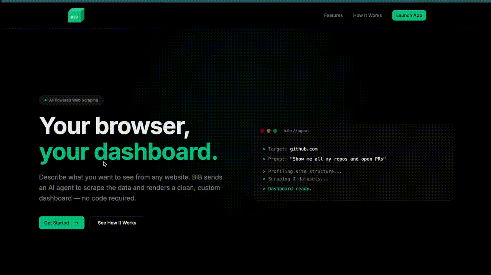

# BiB — Browser in Browser

Generate custom UIs to display live data from any website.



## Quick Start

### Backend

```bash
cd backend
python -m venv .venv && source .venv/bin/activate
pip install -r requirements.txt
cp .env.example .env  # Fill in your API keys
uvicorn app.main:app --reload --port 8000
```

### Frontend

```bash
cd frontend
npm install
npm run dev
```

Open http://localhost:5173

## Architecture

- **Backend:** FastAPI + Browser Use + MiniMax
- **Frontend:** React + Vite + Tailwind
- **Communication:** WebSocket (live data) + REST (profile CRUD)
